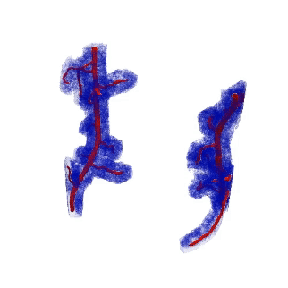

# Understanding pore space at the root soil interface in soil
## Authors: [Richard Harwood](https://richardharwood.github.io./) and [Devin A. Rippner](https://functionalsoilhealth.com/) 
### Overview 
Soil has been referred to as the most complex biomaterial on earth (Young and Crawford 2004), this complexity is increased when the focus is on the plant-soil interface. It is well understood that soil structure and soil biota influence soil health and that plant root architecture and root exudates are influential. The most obvious way that plant roots change soil structure is through physical force. As a plant root navigates through the soil it changes not just the physical structure but also the chemical and biological properties in its immediate vicinity (Hinsinger 2009). During root growth a distinct volume of soil often adheres to the plant root called the rhizosheath, and immediately adjacent to this is an area of soil called the rhizosphere that is distinctly different to bulk soil which is further away from the root system. The rhizosheath and rhizosphere have a very interesting implication: they show that a small volume of soil that is close too, but not touching, the root system can have different structural, chemical, and biological properties to near-by bulk soil. In this distinct volume of soil, bacteria form microaggregates by binding soil particles together with their secretions (Ingham 2009). Examples of root morphology include the presence and size of root hairs, the length of roots along with their branching properties. Examples of rhizosheath properties include the amount of soil adhering to the root and root hairs along the with the proportion of the root covered in soil. Rhizosheath soil can also have a different pore network, different soil aggregate sizes and microbial community. These root and rhizosheath traits change a plants capacity to uptake water and nutrients allowing the plant to tolerate water deficits, heat stress and limited nutrient availability.
 

A soils overall productivity is linked, in part, to the size, shape, density and connectiveness of its airspaces. The 3D architecture of a soil influences the rate, flow and retention of water and solutes (Luo et al., 2010). Given the importance of both pores and rhizosheath it is evident that plants need to strike a balance in the amount of soil that covers the root and the porosity of that soil (Schmidt et al. 2012). Root hair length and root hair density would influence this balance. For example, a plant with long and dense root hairs would have an interface with the pores in the rhizosheath (e.g. Duddek et al 2023). Whilst a plant with no root hairs would only have an interface with the soil and pores immediate to the main root.
 

Here we highlight how recent advancements in deep learning (Rippner et al. 2022) provide a framework for extracting 3D root-soil data from uCT datasets, all within the Python programming language. Our workflow allows for a quick and easy overview of the root-soil interface, in particular capturing porosity, tortuosity, the number and size of discrete pores, the number of connections between pores along with the proportion of root surface that is in contact with the pore space. Here we show the workflow on 30 plants (totaling ~60 000 individual images) and demonstrate its capacity to quantify the 3D complexity of the root-soil interface.
 

Understanding root morphology and soil structure requires a non-invasive imaging technique, the data presented here is from the Australian Synchrotron (Figure 1a). Synchrotrons provide a much higher throughput then commercial u-ct scanners, however the workflow presented here is generic in nature and is suitable for any volume imagine techniques. Image segmentation starts by generating training data, this is the only non-automated step of the workflow. In open-source image analysis software (e.g. “ImageJ) a corresponding label image is generated for a number of Z slices, this is done in both the XY and ZY orientation (Figure 1b, XY orientation show). These images are then used to train a predictive model (here we use a ResNet model, described in detail with fully reproducible examples in Rippner et al ). The trained model can then be used to predict the probability of each pixel of an unseen image aligning with the training data (model output shown in figure 1c: roots (in red) along with the pore network of the rhizosheath (blue)). A subsample of training data is reserved to test the accuracy of the model, that is, compare the model output to an expertly annotated image.
 

Once the images are in the form of labels a suite of information can be quantified ranging from relatively simple (e.g. the proportion of soil that is pore space: porosity), to more complex metrics such as: the distance from the root surface to the nearest pore space (figure 1d, hotter colors indicate that a pore is far away from the root surface), the size and connections of discrete pore regions (figure 1e, shown here is the connections between pores, hotter colors indicate that the distance between pores is greater), the 3D tortuosity of the pore space and the proportion of root touching pores (figure 1f, 3D tortuosity is calculated using random walkers, each colour is a walker and each step is recorded, the walk is terminated when the walker hits soil, root or the pot). Together these metrics describe belowground structural complexity and are described in full detail with reporduble examples in thie repositry (images linked here) 

 

###### Figure 1: A cross section of volume render of the raw ct data (a) a grayscale Z slice and a corresponding mask used to train the deep learning model (b) roots (red) and pore space (blue) from the output of the deep learning model (c) the distance from the surface of the root to the nearest pore space (hotter colours represent a greater distance: d) the connections between pores, hotter colors indicate that the distance between pores is greater (e) the random walker workflow (each colour is a walker and each step is recorded, the walk is terminated when the walker hits soil, root or the pot: f)   

## Workflow
The very first step is to "wrangle" the data. Volume microscopy data comes in many file formats and shapes. Our images came as 3D TIFFS but we needed then as image sequences (a folder of 2D images, that when joined together create a 3D image). This is done with the “Convert_3D_Images_To_Slices.ipynb”. 

From here we need to produce training data for the model. The images from the CT scanner are 16bit so can have up to 65,536 unique values. To draw meaningful information from the images we need to class them into labels. For example, we create an image which has only 5 values: “root”, “soil”, “pore”, “plastic growth pot”, “background”. 
Each 3D image has ~2000 slices so doing this by hand would take months to years. Enter deep learning and training data, the idea is that we can perfectly segment ~ 40 images randomly selected from the 16bit images and manually assign the labels (can be done in ImageJ see Figure 1b). Once segmented the 16bit image is saved in a folder called “images” and the mask is saved in a folder called “mask”. Consistency is the key here, the 16bit image must have the same name and the relevant label must be the same value (e.g. “root” is always 2)

To provide better examples to the model we also resliced the data (reslice.ipynb), essentially this switches from an XY perspective to a XZ (example below in Figure 2) perspective. We see this is pseudo – 3D training. 

 

This data is then used to train the model, here we used the established workflow from  [“A workflow for segmenting soil and plant X-ray computed tomography images with deep learning in Google’s Colaboratory”](https://www.frontiersin.org/articles/10.3389/fpls.2022.893140/full)by Rippner et al (2022). 

It is important to note that a to run the model on a “normal” GPU (e.g. ~ 8gb VRAM), the images will need to be reduced drastically (e.g. a 5 fold decrease in quality). To avoid image reduction, we troubleshooted on local computers and then rented a high-end GPU (e.g. nvidia a100) to train the model. The model can then be downloaded and images can be processed locally, this is the most cost effective approach as processing the data with the model is time consuming but not necessarily needing of high end computational resources.  

For parameters it is best to refer to Rippner et al (2022), the [YouTube video tutorial is very informative](https://www.youtube.com/watch?v=_5AIN8Wm-PQ). (Our version of the model training is Model_Training.ipynb)
Multiple models are trained, adn testeed on segmented data that is left out of model training ("validation data"). Accuracy metrics are recorded and the best model is chosen.

 

This [blog post](https://towardsdatascience.com/accuracy-precision-recall-or-f1-331fb37c5cb9) explains the metrics and how to interpret them. It is important to stay grounded, even a trained expert hand-segmenting every slice would make some mistakes. The use of this automated approaches is always a balance between accuracy and efficiency.  

Once this notebook is run we have a segmented folder for each CT scan, here is a random slice to see the example output:

 

There are clearly some minor issues, from here we can do some post processing to clean up the images or add more training data to the model and retrain to improve. (the latter is better but more time consuming, so we took the first option).
Which leads to the next step wrangling the data and performing quantitative analysis.

This is all done in the next notebook "wrangle_fnn_porespy_3D_tau_touching.ipynb" which performs the following tasks:
* Finesses the root segmentation using a dilate , erode, fill holes, remove small objects workflow. 
* Dilates the area around the roots to a set voxel value to create an arbitrary rhizosheath (for example at voxel size 6.5um dilated 160 voxels would create a 1mm rhizosheath (see Figure 1c), anything not “rhizosheath” is bulk soil. 
* Calculates the volume of the rhizosheath and the volume or pore in the rhizosheath to calculate porosity and compares this to porosity in the bulk soil.
*Calculates the distance from the surface of the root to the nearest porespace (Figure 1d) from this the proportion of root surface in contact with pore or soil can be calculated.
Uses a random walker approach to quantify 3D directional tortuosity in the rhizosheath (Figure 1f) and the bulk soil. This is calculated using [“pytrax: A simple and efficient random walk implementation for calculating the directional tortuosity of images”](https://www.sciencedirect.com/science/article/pii/S2352711019302286) ) 
* Calculates a suite of pore network characteristics (e.g. number and size of unique pore spaces along with the connections between pores) This is calculated using [“Porespy: Quantitative Image Analysis of Porous Materials]( https://porespy.org/) ) 
* Creates STLS (3D meshes) that can be used for finite element methods and visualization

Here is an example of the segmented roots and pore network in the rhizosheath:

 

After running "wrangle_fnn_porespy_3D_tau_touching.ipynb" there is a folder for each image with a wealth of information. The random walk and porespy data can be interacting with in ParaView, to wrangle all the .CSVS there is the "wrangle_and_graph_pore_out.ipynb"which collates and plots the data. 

'

